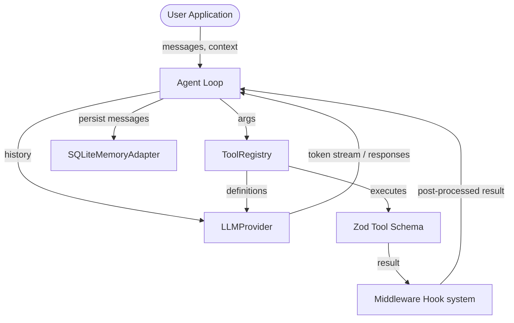

# Mini-Framework Documentation

Welcome to the technical documentation of the TypeScript Agentic Mini-Framework. This framework is a modular, local-first, lightweight, and extensible agentic execution loop written natively in ESM for Node.js (with full TypeScript support).

---

## Architecture Overview

The mini-framework is designed around three main pillars:
1. **Core Loop (Orchestration):** The [Agent](./agent-loop.md) class takes a set of chat messages, invokes an `LLMProvider`, parses tool calls requested by the model, executes tools, and loops until the model finishes or reaches the iteration limit.
2. **Tooling & Schemas:** Standardized TypeScript tool definitions using [Zod](./tooling.md), making schema validation automatic, type-safe, and compatible with OpenAPI-like JSON Schemas.
3. **Extensibility & Persistence:** Hooks for custom workflows using [Middlewares](./middleware.md) (e.g., security, latency logging), state persistence using [SQLite](./persistence.md) database adapters, [Streaming](./streaming.md) token-by-token responses, and connecting to third-party MCP servers via the [MCP Client](./mcp.md).

---

## Table of Contents

- [**1. Tooling & Registry**](./tooling.md)
  Learn how to define tools with Zod, generate JSON schemas, and register them in the `ToolRegistry`.
- [**2. Agent Loop, Message Types & Context**](./agent-loop.md)
  Explore the execution loop (`Agent.run`), chat message definitions (`UserMessage`, `AssistantMessage`, etc.), and injecting context variables.
- [**3. SQLite Persistence & History**](./persistence.md)
  Set up local-first storage using `SQLiteMemoryAdapter` to save and load conversation history.
- [**4. Middleware Hook System**](./middleware.md)
  Configure global or tool-specific `beforeExecute` and `afterExecute` middlewares to handle logging, permission prompts, or output sanitization.
- [**5. Token & Event Streaming**](./streaming.md)
  Consume real-time tokens and tool events via `runStream()`.
- [**6. Model Context Protocol (MCP) Integration**](./mcp.md)
  Spawn subprocess-based MCP servers and consume their remote tools dynamically in your agentic loop.
