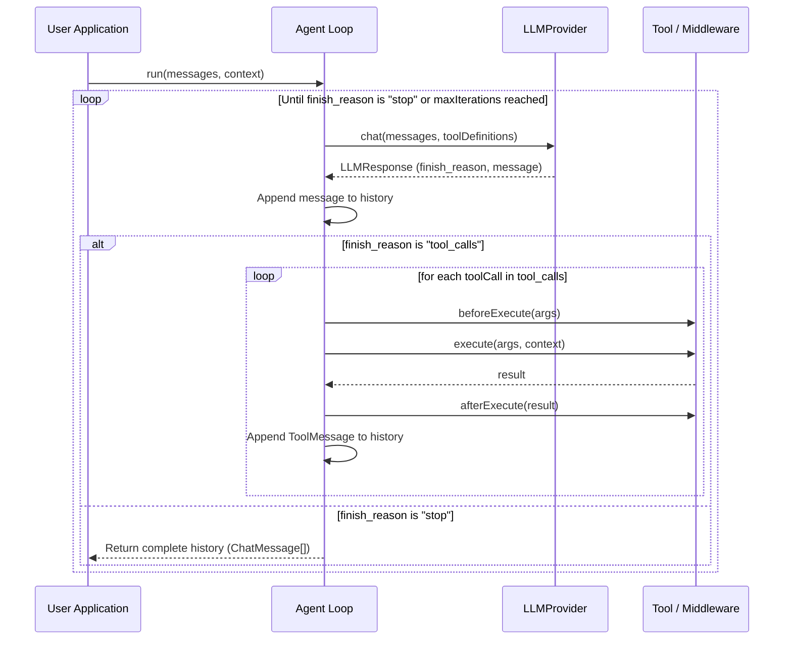

# Agent Loop, Message Types & Context

The `Agent` class orchestrates the interaction loop between the Language Model (LLM) and registered tools. It handles consecutive tool calls dynamically until the model reaches a stopping condition.

---

## 1. Chat Message Types

The framework defines clear TypeScript interfaces for chat history messages. All messages are consolidated in the union type `ChatMessage`:

```typescript
import type { ChatMessage } from 'mini-framework';

// A message sent by the user
const userMsg: ChatMessage = {
  role: 'user',
  content: 'What is 15 + 27?',
};

// A message containing system-level instructions
const systemMsg: ChatMessage = {
  role: 'system',
  content: 'You are a helpful assistant with math tools.',
};

// A response from the assistant, optionally containing tool calls
const assistantMsg: ChatMessage = {
  role: 'assistant',
  content: null,
  tool_calls: [
    {
      id: 'call_123',
      type: 'function',
      function: {
        name: 'add',
        arguments: '{"a": 15, "b": 27}',
      },
    },
  ],
};

// A response returned from executing a tool
const toolMsg: ChatMessage = {
  role: 'tool',
  tool_call_id: 'call_123',
  name: 'add',
  content: '42',
};
```

---

## 2. Orchestration Loop (`Agent.run`)

The Agent is initialized with a `ToolRegistry` and an `LLMProvider`. Below is an architectural overview of how `Agent.run()` processes messages:



### Implementing `LLMProvider`

To build an agent, you must supply an implementation of `LLMProvider`. For example:

```typescript
import type { LLMProvider, ChatMessage, LLMResponse } from 'mini-framework';

export class MyLLMProvider implements LLMProvider {
  async chat(messages: ChatMessage[], options?: { tools?: any[] }): Promise<LLMResponse> {
    // Call OpenAI/Gemini/Anthropic API here
    return {
      message: {
        role: 'assistant',
        content: 'The result is 42.',
      },
      finish_reason: 'stop',
    };
  }
}
```

### Initializing and Running the Agent

```typescript
import { Agent, ToolRegistry } from 'mini-framework';
import { MyLLMProvider } from './my-provider';
import { addTool } from './add-tool';

const registry = new ToolRegistry();
registry.register(addTool);

const provider = new MyLLMProvider();

const agent = new Agent(registry, provider, {
  maxIterations: 5, // Default is 10
});

const messages = [
  { role: 'user', content: 'What is 15 + 27?' }
];

// Execute the loop
const updatedHistory = await agent.run(messages);
console.log(updatedHistory);
```

---

## 3. Dynamic Context Injection

In many applications, tools require access to request-specific state (e.g. current user ID, database connections, API tokens) that shouldn't be hardcoded or visible to the LLM.

The Agent facilitates this via the optional `context` parameter in `Agent.run(messages, context)`. The context is passed dynamically to all executed tools and middlewares.

### Example: Authorized User Settings

```typescript
import { z } from 'zod';
import type { Tool } from 'mini-framework';

interface RequestContext {
  userId: string;
  db: any;
}

const GetUserSettingsSchema = z.object({});

const getUserSettingsTool: Tool<typeof GetUserSettingsSchema> = {
  name: 'getUserSettings',
  description: 'Gets configuration for the current user.',
  schema: GetUserSettingsSchema,
  async execute(params, context: RequestContext) {
    // Retrieve context values dynamically
    const user = await context.db.getUser(context.userId);
    return user.settings;
  },
};
```

To run the agent with context:
```typescript
const context = {
  userId: 'usr_987',
  db: databaseConnection,
};

const history = await agent.run(
  [{ role: 'user', content: 'Get my settings' }],
  context
);
```

---

## Next Steps

To see how you can save the conversation history of the agent loop across multiple sessions, proceed to [3. SQLite Persistence & History](./persistence.md).
