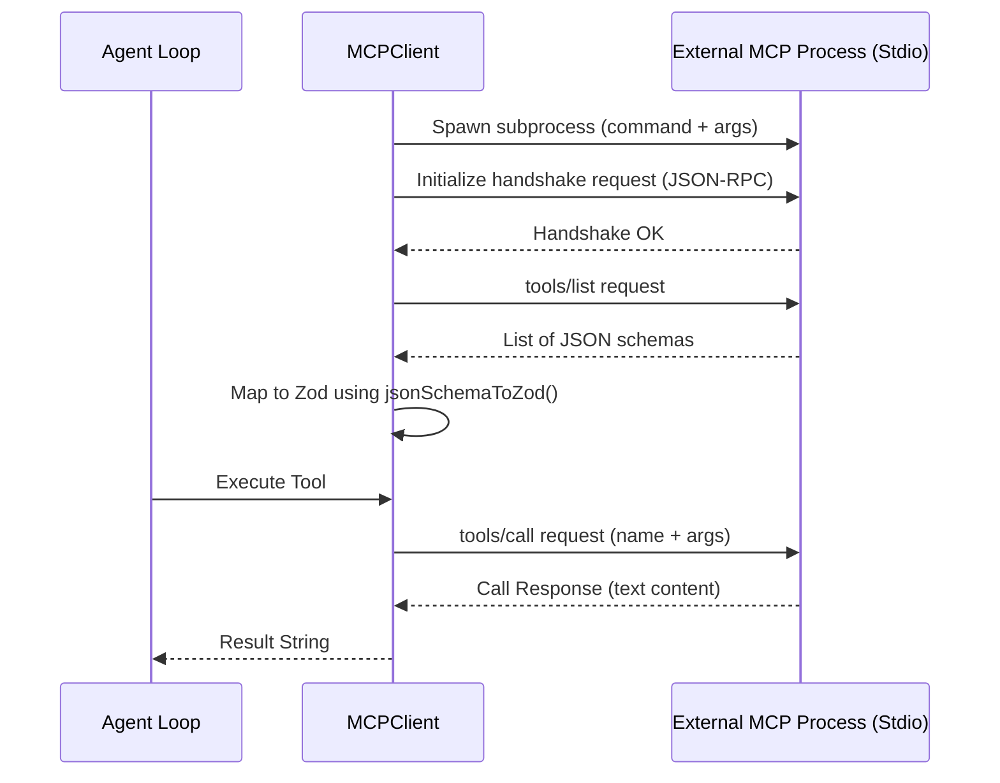

# Model Context Protocol (MCP) Integration

The Model Context Protocol (MCP) standardizes how local or remote servers expose data, tools, and prompts to LLM applications. The mini-framework includes a built-in `MCPClient` that communicates over JSON-RPC 2.0 via standard input/output (stdio) subprocesses.

---

## 1. How the MCP Client Works

The `MCPClient` spawns an external process (e.g. `npx`, Node.js script, or compiled binary) and connects to its `stdin` and `stdout` streams. It performs the initial handshake, retrieves the tools exposed by the server, translates the schemas to Zod, and redirects call executions.



---

## 2. Converting JSON Schemas with `jsonSchemaToZod`

Since MCP servers output tool parameter definitions as JSON Schema, the framework provides a helper function `jsonSchemaToZod()` to construct Zod schemas dynamically at runtime.

This utility maps:
- `string`, `number` / `integer`, `boolean`, and `array` types.
- Field descriptions using Zod `.describe()`.
- Required fields vs optional fields.

```typescript
import { jsonSchemaToZod } from 'mini-framework';

const mcpInputSchema = {
  type: 'object',
  properties: {
    filename: { type: 'string', description: 'Path to target file' },
    linesCount: { type: 'integer' }
  },
  required: ['filename']
};

const zodSchema = jsonSchemaToZod(mcpInputSchema);
// Output is equivalent to:
// z.object({
//   filename: z.string().describe('Path to target file'),
//   linesCount: z.number().optional()
// })
```

---

## 3. End-to-End MCP Integration Example

Here is how to spawn a local file-search MCP server, load its tools, register them, run an agent loop with those tools, and shut down:

```typescript
import { Agent, ToolRegistry, MCPClient } from 'mini-framework';
import { MyLLMProvider } from './my-provider';

async function main() {
  const registry = new ToolRegistry();
  const provider = new MyLLMProvider();

  // 1. Instantiate the MCP client (spawns an external server via stdio)
  const mcpClient = new MCPClient('npx', [
    '-y',
    '@modelcontextprotocol/server-filesystem',
    '/Users/aperezl/ai/mini-framework/workspace'
  ]);

  try {
    // 2. Establish connection and execute handshake
    await mcpClient.connect();
    console.log('Connected to MCP filesystem server.');

    // 3. Retrieve external tools mapped to local Zod tools
    const externalTools = await mcpClient.listTools();
    console.log(`Discovered ${externalTools.length} tools.`);

    // 4. Register them in the agent's ToolRegistry
    for (const tool of externalTools) {
      registry.register(tool);
      console.log(`Registered MCP Tool: "${tool.name}"`);
    }

    // 5. Run the agent execution loop
    const agent = new Agent(registry, provider);
    const history = await agent.run([
      { role: 'user', content: 'List files in my workspace.' }
    ]);

    console.log('Result:', history.at(-1)?.content);

  } catch (error) {
    console.error('MCP flow error:', error);
  } finally {
    // 6. Gracefully terminate the subprocess connection
    mcpClient.close();
    console.log('MCP connection closed.');
  }
}

main();
```
