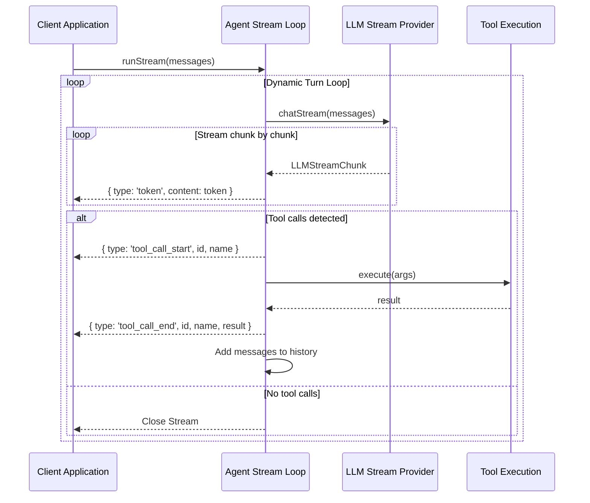

# Token & Event Streaming

Streaming allows client applications to receive assistant tokens in real time (reducing time-to-first-token latency) and monitor tool executions as they start and finish.

---

## 1. Streaming Chunk Types

The `Agent.runStream()` method returns a standard web `ReadableStream` yielding `AgentStreamChunk` items. The chunk is a union type representing different loop events:

```typescript
export type AgentStreamChunk =
  | { type: 'token'; content: string }
  | { type: 'tool_call_start'; toolCallId: string; name: string }
  | { type: 'tool_call_end'; toolCallId: string; name: string; result: any }
  | { type: 'error'; message: string };
```

---

## 2. Dynamic Streaming Loop

When streaming, the agent handles tool calling loops dynamically behind the scenes. If the model emits tool calls, the agent captures them, emits `tool_call_start`, runs the tool (with any attached middlewares), emits `tool_call_end` with the result, sends the tool outputs back to the LLM, and triggers a new stream turn.



---

## 3. Consuming the Stream

Below is an example of invoking `Agent.runStream()` and reading the stream using a standard async reader:

```typescript
import { Agent, ToolRegistry } from 'mini-framework';
import { MyStreamLLMProvider } from './my-stream-provider';

const registry = new ToolRegistry();
const provider = new MyStreamLLMProvider();
const agent = new Agent(registry, provider);

const messages = [{ role: 'user' as const, content: 'Calculate 10 + 20' }];

// 1. Obtain the ReadableStream
const stream = agent.runStream(messages);

// 2. Consume the stream using standard Web API Reader
const reader = stream.getReader();

try {
  while (true) {
    const { done, value } = await reader.read();
    if (done) break;

    switch (value.type) {
      case 'token':
        // Output tokens incrementally (e.g. print directly to stdout without newlines)
        process.stdout.write(value.content);
        break;

      case 'tool_call_start':
        console.log(`\n\n[System] Starting tool: ${value.name} (${value.toolCallId})`);
        break;

      case 'tool_call_end':
        console.log(`[System] Finished tool: ${value.name}. Result:`, value.result);
        break;

      case 'error':
        console.error(`\n[Error] Stream encountered an error: ${value.message}`);
        break;
    }
  }
} catch (error) {
  console.error('Failed reading stream:', error);
} finally {
  reader.releaseLock();
}
```

---

## Next Steps

To connect your agent to external tools hosted on remote Model Context Protocol (MCP) servers, read [6. Model Context Protocol (MCP) Integration](./mcp.md).
